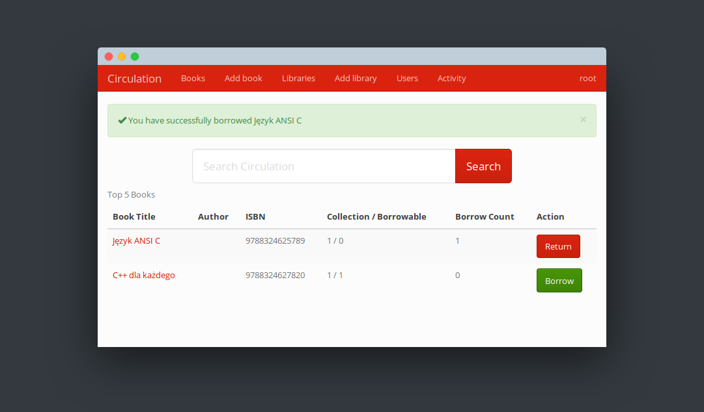

# Circulation
[](https://travis-ci.com/not7cd/circulation)

Circulation encourages people to re-use resources which are too often single use. How many of the books in your home will only be read by one person when there is no reason they could not be read by many people? By making our personal resources available to our neighbors, we hope to foster exchanges in our communities.



## Key Features
  * ~~Support for multiple languages~~
  * Mobile responsive

## Getting Started

These instructions will get you a copy of the project up and running on your local machine for development and testing purposes. See deployment for notes on how to deploy the project on a live system.

### Prerequisites

  * [Python](https://www.python.org/)
  * [virtualenv](https://virtualenv.pypa.io/en/stable/)

### Installing
```bash
# create virtualenv and enterit
pip install -r requirements.txt
python -m circulation
```

or with Pipenv

```bash
pipenv install
pipenv run python -m circulation
```

## Built With

  * [Flask](http://flask.pocoo.org/) - Python Web framework
  * [SQLite](https://www.sqlite.org/) - Database
  * [Bootstrap](http://getbootstrap.com/) - CSS framework

## Contributors

  * **阿卡琳** - *Initial work* - [hufan-akari](https://github.com/hufan-akari)
  * **Justin McLemore** - [justincredble](https://github.com/justincredble/)
  * **Philip Diller** - [PhilipDiller](https://github.com/PhilipDiller)
  * not7cd

See also the list of [contributors](https://github.com/justincredble/circulation/graphs/contributors) who participated in this project.

## License

MIT
